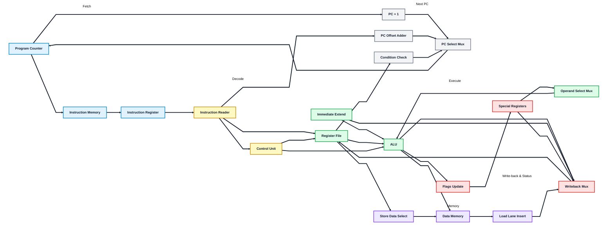

# CS-117 Semester Project

This project implements a custom single-cycle CPU in Verilog, featuring a 20-bit instruction set with both scalar and vector operations. The CPU uses a Harvard architecture (separate instruction and data memory) and a 9-bit program counter to address up to 512 instructions. Key design goals include demonstrating arithmetic, logical, and memory operations in both 16-bit scalar and 64-bit (4×16-bit lane) vector modes. The CPU supports immediate and register-based instructions, branching, and special registers (Hi/Lo) for multiplication results. This report overviews the design, instruction set, module structure, testbench verification, and results, highlighting correct operation and future enhancements.

## Project authors

This project was created by:

* Muhammad Taha Bin Zaeem (CMS ID: 561360)
* Tooba Fatima (CMS ID: 577687)
* Lameea Mubashir Khan (CMS ID: 570918)

Module ownership summary:

* Lameea Mubashir Khan: `control_unit.v`, `instruction_memory.v`, `instruction_register.v`, `instruction_reader.v`, `pc_incrementer.v`, `pc_offset_adder.v`, `pc_select_mux.v`, `program_counter.v`.
* Tooba Fatima: `alu.v`, `flags_update.v`, `operand_select_mux.v`, `register_file.v`, `special_registers.v`, `writeback_mux.v`.
* Muhammad Taha Bin Zaeem: `condition_check.v`, `data_memory.v`, `immediate_extend.v`, `load_lane_insert.v`, `store_data_select.v`, core logic behind all the modules, integration of all components, and `top_module.v`.

## CPU block diagram



## High-level working of the project

At a high level, the datapath follows a classic single-cycle flow:

1. **Fetch**
   * `ProgramCounter` holds the current 9-bit PC.
   * `InstructionMemory` outputs a 20-bit instruction based on the PC.
   * `InstructionRegister` latches the fetched instruction for decoding.

2. **Decode**
   * `InstructionReader` splits the 20-bit instruction into fields (`opcode`, `rd`, `rs`, `rt`, `shamt`, `immediate`, `lane_select`).
   * `ControlUnit` maps the opcode to control signals (ALU operation, register write enable, memory read/write, branch/jump, etc.).

3. **Execute**
   * `RegisterFile` provides two 64-bit operands (`rs` and `rt`).
   * `ImmediateExtend` sign-extends the 9-bit immediate to 16-bit and replicates it across 4 lanes when vector mode is enabled.
   * `OperandSelectMux` chooses the ALU’s second operand (register, immediate, shift amount, or Hi/Lo from special registers).
   * `ALU` performs scalar or vector arithmetic/logic, shifts, and multiply. It also produces flags (zero/negative/carry/overflow).

4. **Memory**
   * `DataMemory` reads/writes 16-bit values.
   * `StoreDataSelect` extracts the 16-bit store lane selected by `lane_select`.
   * `LoadLaneInsert` inserts a 16-bit value into the selected lane; in the top-level wiring the other lanes are zeroed.

5. **Write-back & Status**
   * `WritebackMux` selects the value written to the register file (ALU result, load data, immediate, or special register data).
   * `FlagsUpdate` updates the status register bits (Z, N, C, V) when enabled.
   * `SpecialRegisters` stores Hi/Lo (for multiply results) and the status register.

6. **Next PC logic**
   * `ConditionCheck` evaluates branch conditions (BEQZ/BEQ).
   * `PCIncrementer` produces PC + 1.
   * `PCOffsetAdder` creates branch/jump targets.
   * `PCSelectMux` chooses sequential PC or branch target.

## Instruction format

The 20-bit instruction is split as:

```
[4:0]   opcode
[7:5]   rd (destination)
[10:8]  rs (source 1)
[13:11] rt (source 2)
[19:14] shamt
[19:11] immediate (I-type) / jump address (J-type)
[19:18] lane_select (I-Modified)
```

This means:
* **R-type** instructions use `rd`, `rs`, `rt`, and optional `shamt`.
* **I-type** instructions use `rd`, `rs`, and `immediate`.
* **Vector/lane-modified** instructions can use `lane_select` for insert/merge behavior.
* **Extended MIN/MAX/EQ opcodes (29–31)** use `lane_select` as mode bits:
  * `lane_select[0]` = 1 → use immediate as operand B (I-type variant)
  * `lane_select[1]` = 1 → enable vector lanes (vector variant)
  * Immediate for these opcodes uses bits `[17:11]` (7-bit signed), because bits `[19:18]` are reserved for mode.

## Opcode summary (from `ControlUnit`)

| Opcode | Name   | Behavior (summary) |
|-------:|--------|--------------------|
| 0      | ADD    | Scalar add, update flags, write rd |
| 1      | SUB    | Scalar sub, update flags, write rd |
| 2      | AND    | Scalar and, update flags, write rd |
| 3      | OR     | Scalar or, update flags, write rd |
| 4      | XOR    | Scalar xor, update flags, write rd |
| 5      | SLL    | Scalar shift left, update flags, write rd |
| 6      | SRL    | Scalar shift right, update flags, write rd |
| 7      | MUL    | Scalar multiply, write Hi/Lo, update flags |
| 8      | VADD   | Vector add (4×16-bit lanes) |
| 9      | VMUL   | Vector multiply (4×16-bit lanes) |
| 10     | ADDI   | Scalar add immediate, update flags, write rd |
| 11     | VADDI  | Vector add immediate |
| 12     | LW     | Load 16-bit from data memory |
| 13     | SW     | Store 16-bit to data memory |
| 14     | LI     | Load immediate into rd |
| 15     | VLI    | Vector load immediate (replicated) |
| 16     | BEQZ   | Branch if rs == 0 |
| 17     | BEQ    | Branch if rs == rt |
| 18     | J      | Jump to immediate target |
| 19     | MFHI   | Move from Hi into rd |
| 20     | MFLO   | Move from Lo into rd |
| 21     | VMIN   | Vector min (signed, per 16-bit lane) |
| 22     | VMAX   | Vector max (signed, per 16-bit lane) |
| 23     | VABS   | Vector absolute value (signed, per 16-bit lane) |
| 24     | VEQ    | Vector compare equal (lane == -> 0xFFFF else 0x0000) |
| 25     | VSEL   | Vector select: if lane in rt is nonzero, take rs lane else 0 |
| 26     | VPASSA | Vector pass-through rs lanes |
| 27     | VZERO  | Vector zero (all lanes cleared) |
| 28     | VREV   | Vector reverse lane order |
| 29     | MIN    | Min of rs/rt; lane_select[0]=immediate, lane_select[1]=vector |
| 30     | MAX    | Max of rs/rt; lane_select[0]=immediate, lane_select[1]=vector |
| 31     | EQ     | Compare rs/rt; lane_select[0]=immediate, lane_select[1]=vector |

## How to simulate in Xilinx ISE Design Suite

> These steps assume ISE 14.x (Project Navigator + ISim). The flow is the same for later versions with minor UI differences.

### 1) Create a new ISE project
1. Open **Xilinx ISE Design Suite** → **File** → **New Project**.
2. Choose a project name (e.g., `ictrpoject_cpu`) and location.
3. Select your target device (or pick a generic family if you only need simulation).

### 2) Add sources
1. **Project** → **Add Source**.
2. Add **all** `.v` files from `project/`:
   * `alu.v`, `control_unit.v`, `instruction_memory.v`, `data_memory.v`, `register_file.v`, etc.
3. Add `top_module.v` (`TopModule`) as the top-level module for simulation, or plan to create your own wrapper in the next step.

### 3) Use the provided top-level wrapper (recommended)
This repo includes a top-level integration module at `project/top_module.v` (`TopModule`). Add it to your project and use it as the simulation top.

If you prefer to roll your own wrapper, create a module (e.g., `cpu_top.v`) that:

* Instantiates all modules.
* Connects control signals, ALU, memory, PC logic, and write-back paths.
* Exposes clock/reset so the design can be driven by a testbench.

If you prefer, you can skip a top-level wrapper and instead build a **testbench** that instantiates the modules directly.

### 4) Create a testbench
1. **Project** → **New Source** → **Verilog Test Fixture**.
2. Provide a name (e.g., `cpu_tb`) and target your top-level wrapper.
3. Drive `clk` and `reset` signals and observe internal signals with waveforms.

### 5) Initialize memories
* Edit `InstructionMemory` and load real instructions by changing `instr_mem[x]` in its `initial` block.
* Edit `DataMemory` and pre-load test data by setting `data_mem[x]` in its `initial` block.

### 6) Run simulation
1. Switch the top view to **Simulation**.
2. Select **Behavioral Simulation** → **Simulate Behavioral Model**.
3. In ISim, add signals to the waveform window and run the simulation.

## How to check the design is working properly

Use a simple test program and validate expected register/memory changes:

1. **Program Counter**
   * Confirm PC increments by 1 each instruction.
   * Confirm branches and jumps update PC to the correct target.

2. **Register writes**
   * Check `RegisterFile` after ALU instructions to confirm `rd` contains the correct result.
   * Validate `LI/VLI` write the immediate into the destination.

3. **Memory operations**
   * For `LW`, verify the read address (`rs + immediate`) returns correct data and write-back stores it into `rd`.
   * For `SW`, verify the LSB lane of `rt` is written to the correct address.

4. **Vector ops**
   * For `VADD/VMUL/VADDI`, verify each 16-bit lane matches the expected value.

5. **Flags and special registers**
   * After scalar arithmetic, confirm Z/N/C/V flags update as expected.
   * After `MUL`, verify Hi/Lo are updated and `MFHI/MFLO` move values to the register file correctly.

### Suggested verification flow
1. Build a short program (5–10 instructions) in `InstructionMemory` that exercises:
   * ADD/ADDI
   * LW/SW
   * Branch (BEQZ/BEQ)
   * Vector add or multiply
2. Simulate and watch these signals in the waveform:
   * `pc_out`, `instr_out`, `opcode`
   * `read_data1`, `read_data2`, `write_data`
   * `mem_read`, `mem_write`, `address`, `read_data`
   * `result`, `zero`, `negative`, `carry`, `overflow`
3. Compare against manual expected results for each instruction.

## Directory overview

* `project/` – All Verilog modules (datapath components).
* `README.md` – This document.

## Module inventory

| File | Module | Purpose | Author |
|------|--------|---------|--------|
| `project/alu.v` | `ALU` | Scalar/vector arithmetic, logic, shift, and multiply operations. | Tooba Fatima |
| `project/control_unit.v` | `ControlUnit` | Decodes opcode to control signals. | Lameea Mubashir Khan |
| `project/condition_check.v` | `ConditionCheck` | Evaluates BEQZ/BEQ branch conditions. | Muhammad Taha Bin Zaeem |
| `project/data_memory.v` | `DataMemory` | 16-bit data memory for load/store. | Muhammad Taha Bin Zaeem |
| `project/flags_update.v` | `FlagsUpdate` | Updates Z/N/C/V status bits. | Tooba Fatima |
| `project/immediate_extend.v` | `ImmediateExtend` | Sign-extends and lane-replicates immediates. | Muhammad Taha Bin Zaeem |
| `project/instruction_memory.v` | `InstructionMemory` | 20-bit instruction ROM. | Lameea Mubashir Khan |
| `project/instruction_reader.v` | `InstructionReader` | Splits instruction into fields. | Lameea Mubashir Khan |
| `project/instruction_register.v` | `InstructionRegister` | Latches fetched instruction. | Lameea Mubashir Khan |
| `project/load_lane_insert.v` | `LoadLaneInsert` | Inserts 16-bit load data into a selected lane. | Muhammad Taha Bin Zaeem |
| `project/operand_select_mux.v` | `OperandSelectMux` | Selects ALU operand sources. | Tooba Fatima |
| `project/pc_incrementer.v` | `PCIncrementer` | Computes PC + 1. | Lameea Mubashir Khan |
| `project/pc_offset_adder.v` | `PCOffsetAdder` | Computes PC branch/jump targets. | Lameea Mubashir Khan |
| `project/pc_select_mux.v` | `PCSelectMux` | Selects next PC source. | Lameea Mubashir Khan |
| `project/program_counter.v` | `ProgramCounter` | Holds current PC value. | Lameea Mubashir Khan |
| `project/register_file.v` | `RegisterFile` | 64-bit register file (scalar/vector). | Tooba Fatima |
| `project/special_registers.v` | `SpecialRegisters` | Stores Hi/Lo and status register. | Tooba Fatima |
| `project/store_data_select.v` | `StoreDataSelect` | Extracts store data lane. | Muhammad Taha Bin Zaeem |
| `project/writeback_mux.v` | `WritebackMux` | Selects write-back data. | Tooba Fatima |
| `project/top_module.v` | `TopModule` | Top-level integration wrapper. | Muhammad Taha Bin Zaeem |

## Notes

* Instruction and data memory are initialized to zero by default. You must load meaningful values for real simulations.
* The design is modular; you can test individual blocks (e.g., ALU or register file) without building the full CPU.

Sample test program code:
```
// 00: LI   r1, 12                         -> 20'h0602E
instr_mem[0]  = 20'h0602E;
// 01: LI   r2, 5                          -> 20'h0284E
instr_mem[1]  = 20'h0284E;
// 02: LI   r3, -1   (imm=0x1FF)           -> 20'hFF86E
instr_mem[2]  = 20'hFF86E;
// 03: ADDI r2, r2, 7                      -> 20'h03A4A
instr_mem[3]  = 20'h03A4A;
// 04: ADDI r2, r2, -2                     -> 20'hFF24A
instr_mem[4]  = 20'hFF24A;

// 05: ADD  r4, r1, r2                     -> 20'h01180
instr_mem[5]  = 20'h01180;
// 06: SUB  r4, r1, r2                     -> 20'h01181
instr_mem[6]  = 20'h01181;
// 07: AND  r4, r1, r2                     -> 20'h01182
instr_mem[7]  = 20'h01182;
// 08: OR   r4, r1, r2                     -> 20'h01183
instr_mem[8]  = 20'h01183;
// 09: XOR  r4, r1, r2                     -> 20'h01184
instr_mem[9]  = 20'h01184;

// 10: SLL  r5, r2, 3                      -> 20'h0C2A5
instr_mem[10] = 20'h0C2A5;
// 11: SRL  r5, r5, 1                      -> 20'h045A6
instr_mem[11] = 20'h045A6;

// 12: VLI  r5, 1                          -> 20'h008AF
instr_mem[12] = 20'h008AF;
// 13: VLI  r6, 2                          -> 20'h010CF
instr_mem[13] = 20'h010CF;
// 14: VADD r7, r5, r6                     -> 20'h035E8
instr_mem[14] = 20'h035E8;
// 15: VADDI r7, r7, 3                     -> 20'h01FEB
instr_mem[15] = 20'h01FEB;
// 16: VADDI r7, r7, -1                    -> 20'hFFFEB
instr_mem[16] = 20'hFFFEB;
// 17: VMUL r5, r6, r6                     -> 20'h036A9
instr_mem[17] = 20'h036A9;

// 18: LI   r1, 200                        -> 20'h6402E
instr_mem[18] = 20'h6402E;
// 19: LI   r2, 3                          -> 20'h0184E
instr_mem[19] = 20'h0184E;
// 20: MUL  r1, r2   (writes HI/LO)        -> 20'h01107
instr_mem[20] = 20'h01107;
// 21: MFLO r3                             -> 20'h00074
instr_mem[21] = 20'h00074;
// 22: MFHI r4                             -> 20'h00093
instr_mem[22] = 20'h00093;

// 23: LI   r1, 17    (base)               -> 20'h0882E
instr_mem[23] = 20'h0882E;
// 24: SW   [r1 + 3], r3  (store lane0)    -> 20'h0190D
instr_mem[24] = 20'h0190D;
// 25: LW   r2, [r1 + 3]  (load lane0)     -> 20'h0194C
instr_mem[25] = 20'h0194C;

// 26: LI   r1, 30    (base)               -> 20'h0F02E
instr_mem[26] = 20'h0F02E;
// 27: SW   [r1 + 6], r6  (store lane0)    -> 20'h0310D
instr_mem[27] = 20'h0310D;
// 28: LW   r7, [r1 + 6]                   -> 20'h031EC
instr_mem[28] = 20'h031EC;

// 29: BEQZ r0, +3   (pc = pc + 3)         -> 20'h01810
instr_mem[29] = 20'h01810;
// 30: BEQ  r1, r2, +2   (pc = pc + 2)     -> 20'h01111
instr_mem[30] = 20'h01111;
// 31: J    40       (pc = 40)             -> 20'h14012
instr_mem[31] = 20'h14012;
```


## Results and Observations

The simulation confirmed that all tested instructions execute correctly in a single cycle. Observations include:

* **Instruction Fetch/PC:** The PC increments sequentially for normal flow and branches/jumps when triggered. The testbench confirmed that BEQ/BEQZ instructions change the PC appropriately and skip instructions correctly.
* **Arithmetic and Logic:** Scalar operations (ADD, SUB, AND, etc.) produce correct 16-bit results in the lower half of the 64-bit result, with higher lanes zero. Flags update as expected (e.g. zero flag set when result is zero). For example, after ADDI r4, r3, -2, register r4 contained the correct result (7) and the negative flag was clear.
* **Vector Operations:** Vector add and add-immediate correctly processed each 16-bit lane independently. After VLI r5, r1, 1, register r5 had all lanes equal to the immediate value. After VADDI r5, r5, 2, each lane of r5 increased by 2, yielding uniform results across lanes. These match hand-calculated values.
* **Memory Access:** For the SW instruction, the least-significant lane of the source register was written to the addressed memory location. The subsequent LW correctly retrieved this 16-bit value and wrote it back to a register. Inspection of the data memory contents in ISim showed the value stored at the correct address.
* **Special Registers:** The multiply instruction (MUL) updated the 64-bit HI/LO registers. Using MFHI and MFLO, the high and low parts were moved into general registers correctly. No overflow occurred in our 16-bit test vectors, so flags were unaffected.
* **Flags:** The status flags (Zero, Negative, Carry, Overflow) were updated after each arithmetic instruction. For example, after a subtraction that resulted in a negative value, the Negative flag was set. After a zero result, the Zero flag was set. These were visible in the simulation waveforms.
* **Single-Cycle Timing:** All operations completed within one clock, as expected. No timing hazards occurred since only single-cycle design was targeted (no pipelining hazards exist).

Overall, the CPU behaved as designed. All instructions in the test program produced the correct results, and the hardware units (ALU, memory, etc.) functioned together as intended.
